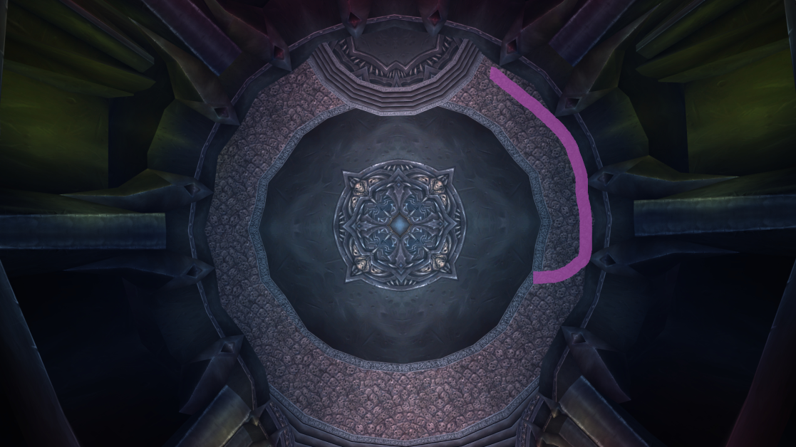

# Reina de Sangre Lana'thel

## Espejo de Sangre
Mecánica de tanques. Esta habilidad vincula a la persona que está tanqueando a Lana'thel con la persona más cercana a ese tanque. El Espejo de Sangre transfiere el 100% del daño hecho al tanque a quien tenga el Espejo de Sangre.  
Para manejar esta habilidad, simplemente coloca un tanque encima del otro tanque. Como el otro tanque solo tiene que quedarse ahí, puede estar inactivo, pero, por supuesto, no lo hagas, usa CDs y haz algo de daño.

El daño del Espejo de Sangre es daño de sombras y no puede ser esquivado, parado o bloqueado, lo que significa que el tanque principal (MT) ideal para esta pelea será un paladín protección, ya que puede bloquear. El tanque secundario (OT) ideal sería un Caballero de la Muerte sangre (BDK) o un oso druida (Bear). Un BDK tiene acceso a AMS y muchos otros CDs, además de curaciones personales, mientras que un Bear tiene la mayor cantidad de vida en el juego.

En una emergencia en la que uno de los tanques muere, un MDPS debe colocarse encima del tanque que sigue vivo y usar habilidades como burbuja o muro de escudo para darle tiempo al tanque de recibir una resurrección en combate, buffs y recuperar toda su vida.

## Corte Delirante
Es una hemorragia aplicada a la persona que tiene el Espejo de Sangre. Solo cúralo.

## Pacto de los Caídos Oscuros
Vincula a 2 jugadores en 10 personas y a 3 en 25 personas con un láser rojo. Los jugadores cercanos al vínculo o que se paren sobre la línea roja recibirán mucho daño. Cuantos más objetivos del vínculo estén cerca de ti, más daño recibirás.  
Si todos los jugadores que tienen el vínculo se unen, el vínculo se elimina. Si te toca el pacto, debes acercarte a los otros jugadores lo antes posible para reducir el daño que recibe la raid. Esta es la habilidad por la que mucha gente suele morir, ya que no son lo suficientemente rápidos para vincularse, así que usa botas cohete si es necesario.

## Sombras Enjambre
Esta habilidad te pone un debuff de 2-3 segundos. Después de que desaparezca, obtendrás otro debuff que deja llamas en el suelo. Las llamas hacen mucho daño y tienen un área de impacto engañosa, así que mantente lejos.  
Después de que te pongan esta habilidad, debes moverte rápido hacia el borde de la sala y soltar las llamas a lo largo de la pared. Si vas por el lado derecho de la sala y ya hay fuego allí, deja tus llamas al lado, pero no te acerques demasiado al otro fuego o morirás.  
No hagas giros en U: esto significa que no corras de vuelta al jefe mientras todavía tengas segundos de llamas. Solo mantente cerca de la pared hasta que el debuff desaparezca.

### Forma correcta de colocar las llamas

### Forma incorrecta de colocar las llamas

Hay formas de eliminar el debuff de sombras, que deberían usarse en cuanto estén disponibles si te tocan las llamas:

- **Formas de eliminar el debuff**, independientemente de si tienes el primer debuff o el de las llamas:
  - Burbuja
  - Bloque de hielo  
  Debes llegar al punto en el que tienes el debuff de las llamas y aún no hayas usado tu inmunidad. Nunca dejes un camino de llamas en el suelo si puedes evitarlas fácilmente.

- **Formas de eliminarlo solo si tienes el primer debuff**:
  - Fusión de las sombras
  - Capa de las sombras
  - AMS
  - Desvanecerse  
  El uso de estas habilidades requiere un tiempo perfecto. En el momento en que obtengas el debuff, deja de hacer lo que estés haciendo y úsala. AMS y capa son fáciles de usar, pero desvanecerse (pícaro) y fusión (elfo de la noche) pueden ser complicadas, especialmente si eres DPS a distancia. Usa la habilidad lo más rápido posible y asegúrate de no tener ningún debuff antes de continuar.

## Proyectil de Sangre Crepuscular
Es un proyectil que inflige aproximadamente 10k de daño de sombras a una persona aleatoria y a todos los que estén a 8 yardas de ellos. Por eso es importante estar dispersos.

## Incitar el Terror
Cada 2 minutos, Lana'thel corre al centro de la sala y provoca miedo a todos, lo que luego da paso a la fase aérea (P1.5).  
Esta habilidad ocurre al mismo tiempo que Sombras Enjambre, por lo que si la persona afectada no es un pícaro, paladín, DK o mago, necesitará un Fear Ward para no ser aterrorizado. Si se aterroriza, morirá por las llamas. Un **Mass Dispel** bien cronometrado también puede eliminar el miedo.

## Fase Aérea
Después del miedo, Lana'thel vuela hacia el aire y comienza a lanzar **Remolino de Proyectiles de Sangre**, lo que causa mucho daño. Después del miedo, todos deben estar a 8 yardas de distancia.  
Todos deben usar sus CDs defensivos aquí: piel de corteza, escudo de hueso congelado (IBF para DK DPS), fingir muerte, etc. También son útiles habilidades como himno divino, tranquilidad, sombra AM y sacrificio divino (DSac).  
Esta fase dura unos segundos y luego Lana'thel baja y todo se repite.

## Mordisco Vampírico
Esta es la parte central de este encuentro. Es un debuff de 1 minuto que se aplica a quien esté segundo en amenaza al inicio. Da un 100% de daño adicional, hace que la persona no genere amenaza y la cura un poco.  
Después de que pase 1 minuto, el jugador solo tendrá una nueva habilidad: morder a otro jugador y darle el debuff. Si no muerde a nadie en 10 segundos, será controlado mentalmente, lo que es muy malo y probablemente cause un wipe.  
Antes del encuentro, el líder de la raid organizará un orden de mordisco para facilitarlo.  
La persona con el mordisco no debe moverse para morder a alguien; la persona que necesita ser mordida debe acercarse.

Debido al enrage, habrá 4 rondas de mordiscos (5 si cuentas el primer mordisco que da Lana'thel), lo que significa que habrá 16 personas con el debuff.  
El orden de prioridad suele ser:  
- Magos > Boomkins/Sacerdotes Sombra > Cazadores/Brujos > Cualquier MDPS.  
Si no encuentras a tu objetivo o alguien ya lo mordió, puedes morder a un sanador o al OT.

## Cómo se desarrolla el inicio del combate:
El OT (paladín) y el MT (DK) inician la pelea muy cerca el uno del otro, preferiblemente con botas cohete, y tanquean a la jefa donde está. Los MDPS deben tomarse su tiempo para acercarse, porque si se acercan demasiado rápido, podrían recibir Espejo de Sangre.  
El paladín no debe atacar al jefe al inicio; el DK debe generar su máximo agro. Esto es porque quieres que un DPS reciba el primer mordisco.  
Los cazadores usarán redirección en el DK al inicio, y un pícaro usará redirección de amenazas en un DPS a distancia (usualmente un mago). Después, el paladín provoca al jefe.
